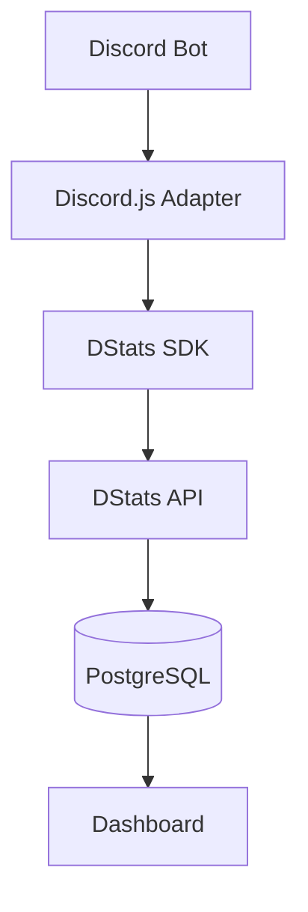

<div align="center">

# DStats

[](https://git.io/typing-svg)

[](https://github.com/ViB404/dstats)
[](https://discord.js.org/)
[](https://www.typescriptlang.org/)
[](https://github.com/ViB404/dstats/blob/main/LICENSE)
[](https://github.com/ViB404/dstats/stargazers)

[](https://dstats.havochz.xyz/dashboard)
[](https://dstats.havochz.xyz/dashboard/api-keys)

Track guild joins, guild leaves, and growth with almost zero setup.

</div>

---

## About

DStats is a lightweight analytics platform for Discord bots.

Instead of building your own analytics pipeline, DStats lets you collect useful statistics with a few lines of code.

---

## Features

- 📈 Guild growth analytics (Coming Soon!)
- 🚪 Guild join tracking
- 🚪 Guild leave tracking
- 📊 Clean analytics web dashboard
- 🔒 Secure API key authentication
- ⚡ Discord.js adapter

---

## Installation

### npm

```bash
npm install @dstats/sdk @dstats/discord.js
```

### pnpm

```bash
pnpm add @dstats/sdk @dstats/discord.js
```

### Yarn

```bash
yarn add @dstats/sdk @dstats/discord.js
```

---

## Quick Start

### Prerequisites

- Node.js 18+
- A DStats API key — [generate one here](https://dstats.havochz.xyz/dashboard/api-keys)

### Setup

```ts
import { Client } from "discord.js";
import { DiscordJSAdapter } from "@dstats/discord.js";
import { Stats } from "@dstats/sdk";

const client = new Client({
  intents: [],
});

await new Stats({
  apiKey: process.env.DSTATS_API_KEY!,
  adapter: new DiscordJSAdapter(client),
});

client.login(process.env.DISCORD_TOKEN);
```

That's it.

Guild joins and leaves are automatically tracked.

---

## Dashboard

Manage your bots and view analytics from the web dashboard.

| Feature          | Link                                          |
| ---------------- | --------------------------------------------- |
| Dashboard        | https://dstats.havochz.xyz/dashboard          |
| Generate API Key | https://dstats.havochz.xyz/dashboard/api-keys |

Current dashboard features:

- Bot overview
- API key management
- Guild analytics
- Join history
- Leave history

> 🚧 Additional analytics are under development.

---

## Architecture



---

## Packages

| Package              | Description        |
| -------------------- | ------------------ |
| `@dstats/sdk`        | Core SDK           |
| `@dstats/discord.js` | Discord.js adapter |

More adapters are planned 🥲.

---

## API

Current endpoints

```
POST /v1/register

POST /v1/guild/join
POST /v1/guild/leave

GET /v1/bot
GET /v1/guilds
```

---

## Tech Stack

### Backend

- Rust
- Axum
- SQLx
- PostgreSQL

### Frontend

- Next.js
- React
- Tailwind CSS

### SDK

- TypeScript

---

## Roadmap

- [x] Guild join tracking
- [x] Guild leave tracking
- [x] Dashboard
- [x] API authentication
- [x] Discord.js adapter
- [ ] Charts
- [ ] Daily analytics
- [ ] Slash command analytics
- [ ] Command usage analytics
- [ ] Member growth
- [ ] Invite tracking
- [ ] Webhooks
- [ ] Additional adapters
- [ ] Public API

---

## Contributing

Contributions are welcome.

1. Fork the repository.
2. Create a feature branch.
3. Commit your changes.
4. Open a Pull Request.

Please keep pull requests focused and descriptive.

---

## Privacy

DStats only stores the information required to provide analytics.

We do not inspect message content or collect unnecessary user data.

---

## License

This project is licensed under the MIT License.

---

## Support

If you find DStats useful, consider supporting the project.

- GitHub Star ⭐
- Report bugs
- Suggest new features
- Contribute code

---

## 🚧 Development Status

DStats is currently under active development.

Breaking changes may occur until the first stable release.

If you're using DStats today, expect APIs and SDKs to evolve as new features are added.

---

<div align="center">

Made with ❤️ for Discord bot developers.

</div>
