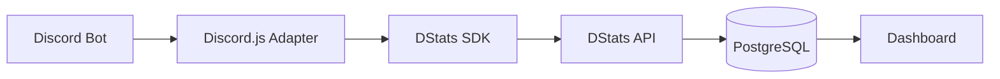

<div align="center">

# DStats

[](https://git.io/typing-svg)

[](https://github.com/ViB404/dstats)
[](https://discord.js.org/)
[](https://www.typescriptlang.org/)
[](https://github.com/ViB404/dstats/blob/main/LICENSE)
[](https://github.com/ViB404/dstats/stargazers)

[](https://dstats.havochz.xyz/dashboard)
[](https://dstats.havochz.xyz/dashboard/api-keys)

Track guild joins, guild leaves, and growth with a few lines of code.

</div>

---

## What is DStats?

DStats gives Discord bot developers a simple way to collect and understand bot analytics without building their own analytics infrastructure.

The SDK handles event collection and sends the data to the DStats API, while the dashboard turns their own data into useful analytics.

### Why DStats?

- Drop-in SDK
- Minimal data collection
- Privacy-first by design
- Built for Discord bots
- Self-contained analytics pipeline
- Open source

---

## Features

- Guild growth analytics
- Guild join and leave tracking
- Command usage tracking
- Clean analytics web dashboard
- Secure API key authentication
- Discord.js adapter

---

## Installation

### pnpm

```bash
pnpm add @dstats/sdk @dstats/discord.js
```

<details>
<summary>npm</summary>

```bash
npm install @dstats/sdk @dstats/discord.js
```

</details>

<details>
<summary>Yarn</summary>

```bash
yarn add @dstats/sdk @dstats/discord.js
```

</details>

---

## Quick Start

### Prerequisites

- Node.js 18+
- A DStats API key — [generate one here](https://dstats.havochz.xyz/dashboard/api-keys)

### Env Variables

```env
DSTATS_API_KEY=your_api_key
DISCORD_TOKEN=your_bot_token
```

### Setup

```ts
import { Client } from "discord.js";
import { DiscordJSAdapter } from "@dstats/discord.js";
import { Stats } from "@dstats/sdk";

const client = new Client({
  intents: [],
});

new Stats({
  apiKey: process.env.DSTATS_API_KEY!,
  adapter: new DiscordJSAdapter(client),
});

client.login(process.env.DISCORD_TOKEN);
```

That's it. Guild joins, leaves, and stats are automatically tracked.

---

## Integrations

### [@dstats/discord.js](https://www.npmjs.com/package/@dstats/discord.js)

Official adapter for Discord.js bots.

```ts
new Stats({
  apiKey: process.env.DSTATS_API_KEY!,
  adapter: new DiscordJSAdapter(client),
});
```

More Discord libraries and adapters are planned.

| Adapter    | Status       |
| ---------- | ------------ |
| Discord.js | ✅ Available |
| Discord.py | 🚧 Planned   |
| Serenity   | 🚧 Planned   |
| Discordeno | 🚧 Planned   |

---

## Dashboard

The DStats dashboard lets you monitor your Discord bot's analytics from one place.

[](https://dstats.havochz.xyz/dashboard)
[](https://dstats.havochz.xyz/dashboard/api-keys)

Available today:

- Bot overview
- Total guilds
- Active guilds
- Command usage tracking
- Guild joins
- Guild leaves
- Join/leave history

> 🚧 Additional analytics are under development.

---

## How it works

DStats consists of three main components:

1. **SDK**: Collects bot events.
2. **API**: Authenticates requests and stores analytics.
3. **Dashboard**: Visualizes collected statistics.


```mermaid
graph LR
    A[Discord Bot] --> B[Discord.js Adapter]
    B --> C[DStats SDK]
    C --> D[DStats API]
    D --> E[(PostgreSQL)]
    E --> F[Dashboard]
```

---

## Privacy

DStats is designed to collect only the data required for bot analytics.

We do not:

- Read message content
- Store message content
- Track unnecessary user activity

DStats focuses on bot-level and guild-level analytics rather than user surveillance.

---

## Packages

| Package              | Description        |
| -------------------- | ------------------ |
| `@dstats/sdk`        | Core analytics SDK |
| `@dstats/discord.js` | Discord.js adapter |

More adapters are planned 🥲.

---

## API

DStats exposes a REST API for SDKs and custom integrations.

| Method | Endpoint          | Description                                      |
| ------ | ----------------- | ------------------------------------------------ |
| GET    | `/`               | Check API status                                 |
| POST   | `/v1/register`    | Register a bot                                   |
| POST   | `/v1/guild/join`  | Record a guild join                              |
| POST   | `/v1/guild/leave` | Record a guild leave                             |
| GET    | `/v1/bot`         | Get bot information                              |
| GET    | `/v1/guilds`      | Get guild data                                   |
| GET    | `/v1/stats`       | Get bot statistics                               |
| POST   | `/v1/event`       | Record Discord bot events, such as command usage |

---

## Built With

| Layer     | Technology        |
| --------- | ----------------- |
| Backend   | Rust + Axum       |
| Database  | PostgreSQL + SQLx |
| Dashboard | Next.js + React   |
| Styling   | Tailwind CSS      |
| SDK       | TypeScript        |

---

## Roadmap

### Analytics

- [x] Guild join tracking
- [x] Guild leave tracking
- [x] Guild statistics
- [x] Command usage analytics
- [x] Charts
- [x] Daily analytics
- [ ] Command performance
- [ ] Member growth
- [ ] Error tracking
- [ ] Event analytics

### Platform

- [ ] Webhooks
- [ ] Public API
- [ ] Additional adapters

---

## Contributing

Contributions are welcome.

Before opening a pull request:

1. Check existing issues.
2. Keep changes focused.
3. Add tests where applicable.
4. Run the project's checks locally.

See [CONTRIBUTING.md](CONTRIBUTING.md) for details.

---

## Community & Support

- Report bugs through GitHub Issues
- Request features through GitHub Discussions/Issues
- Contribute through pull requests
- Star the repository if DStats is useful to you

[](https://discord.gg/aFJjYYfNcY)

---

## License

This project is licensed under the MIT License.

---

## Contributors

<div align="center">

<a href="https://github.com/ViB404/dstats/graphs/contributors">
  
</a>

</div>

---

## Disclaimer

DStats is an independent project and is not affiliated with or endorsed by Discord Inc.

---

<div align="center">

Made with ❤️ for Discord bot developers.

</div>
